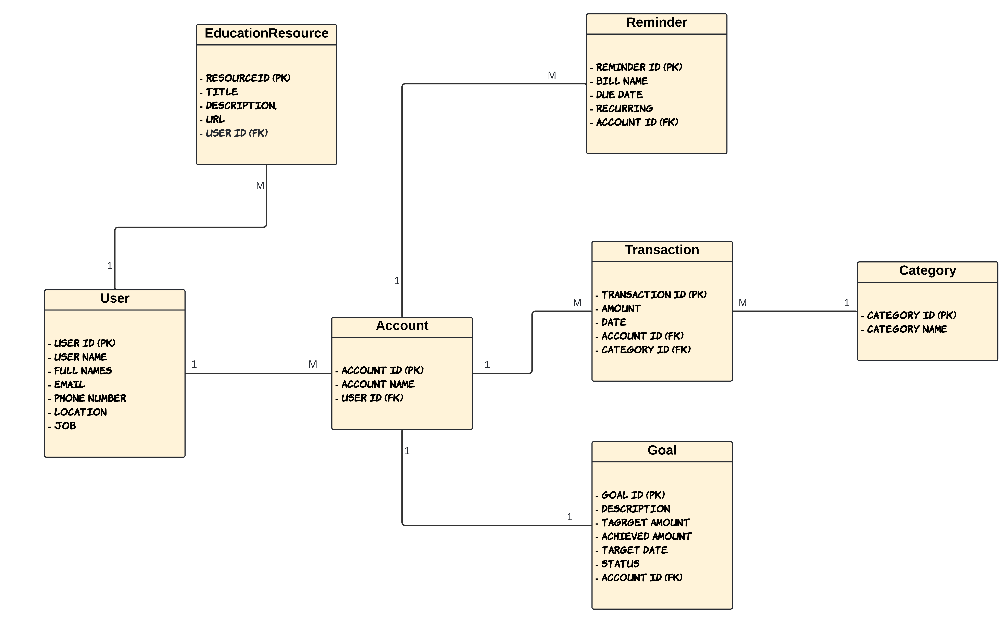

# WalletBuddy Project Report

## Project Overview

WalletBuddy is a comprehensive financial management tool designed to empower users to take control of their finances. The key functionalities of WalletBuddy include user input, data processing, user interface, security and privacy, and user interactions. The project aims to provide users with a secure and intelligent platform to navigate budgeting, track expenses, predict income, and achieve financial wellness.

## Intended Functionality

1. **User Input**:
   - Manual Input: Users can manually input their expenses, incomes, debts, and savings, providing details such as date, amount, and category.
   - Automated Integration: Integration with bank accounts allows for automated data retrieval, reducing manual effort.

2. **Data Processing**:
   - Backend Processing: The backend processes user input data, categorizes finances, and updates the user's financial profile.
   - Different tables in the database, including expenses, incomes, debts, savings, etc., are maintained, each linked to the same client ID, transaction ID, date, etc., to ensure a comprehensive and organized financial record.

3. **User Interface**:
   - Dashboard Overview: The front end presents users with a visually intuitive dashboard displaying their financial overview.
   - Interactive Charts and Reports: Users can explore interactive charts and reports offering insights into spending habits, income predictions, and budget adherence.

4. **Security and Privacy**:
   - Robust Encryption: WalletBuddy prioritizes user data security, implementing robust encryption measures to safeguard sensitive information.
   - Privacy Compliance: The project adheres to privacy regulations, ensuring responsible handling of user data.
   - One-Time Passwords (OTPs): Enhance user authentication through one-time passwords, adding an extra layer of security.

5. **User Interactions**:
   - Frontend Processing: Client Input:
     - Create an account (Username, full name, email, etc)
     - Input finances with details (date, amount, category).
   - Confirmation message upon successful entry.
   - Backend Processing:
     - Categorization of finances into tables (expenses, incomes, debts, savings, etc)
     - Update the user's financial profile
   - Dashboard Overview:
     - Financial Overview on the main dashboard.
     - Quick access to key financial metrics.
     - Interactive Charts and Reports

## Entity-Relationship Diagram (ERD)

The ERD for WalletBuddy includes the following entities:

- **User**: Stores information about users (UserID, Username, FullName, Email, PhoneNumber, Location, Job).
- **Account**: Stores information about user accounts (AccountID, UserID).
- **Transaction**: Stores information about user transactions (TransactionID, AccountID, Date, Amount, CategoryID).
- **Category**: Stores information about transaction categories (CategoryID, CategoryName).
- **Goal**: Stores information about user-set financial goals (GoalID, AccountID, Description, TargetAmount, AchievedAmount, TargetDate, Status).
- **Reminder**: Stores information about user-set bill reminders (ReminderID, AccountID, BillName, DueDate, Recurring).
- **Financial Education Resources**: Offer educational resources on personal finance topics such as budgeting, investing, and debt management.

The relationships between these entities are as follows:
- User (1) ---< Account (1 to many)
- Account (1) ---< Transaction (1 to many)
- Transaction (1) >--- Category (many to 1)
- Account (1) ---< Budget (1 to many)
- Account (1) ---< Goal (1 to many)
- Account (1) ---< Reminder (1 to many)

This ERD ensures a comprehensive and organized database structure to support the functionalities of WalletBuddy.

